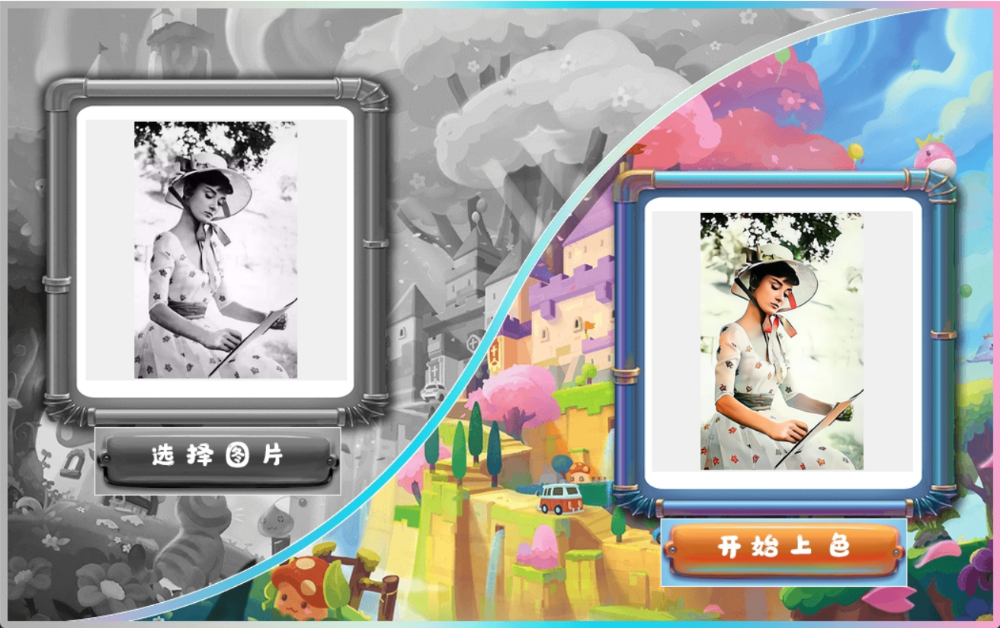
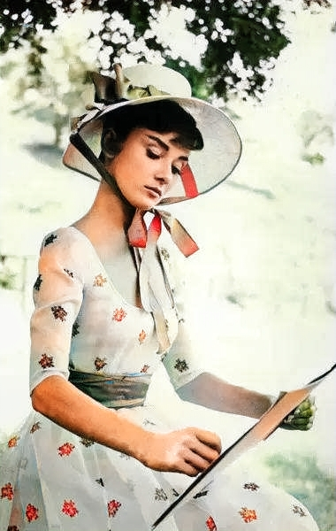
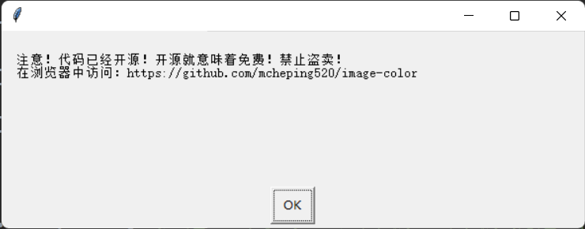

# image-color
## 项目介绍⏰ 
同志们，我问你们一个问题？ 
你们的爸爸妈妈在以前那个时代，年轻的时候长什么样子 ~~帅哥大美女~~ 

很多时候，他们的照片是灰白的，没有颜色，很难分辨

所以，我做了一个项目，可以让老照片上色

## 项目结构以及语言🔍
- 语言：Python
- python-model：tkinter,pillow,requests
- IDE：PyCharm社区版

## 截图

## 原理🔍
绘制客户端，点击选择图片提交给客户端，然后点击上色

客户端会进行**base64(b64encode)加密上传到百度服务器**，然后服务器进行**base64解密(b64decode)**

百度服务器对灰白图片加点颜色，百度服务器上完色之后把**上完色的图片进行base64加密**，返回到客户端，客户端把**加密的图片进行base64解密**，上完色的图片后客户端自动保存**上完色的图片（在根目录里的color.jpg或者doc/color.jpg）** ~~自己写的代码却不知道保存到哪的我是屑~~

### 上完色的图片👇

## 运行方式⚠
- 需要Python才能运行

- 需要导入模块，只需要点击一下**import-pymodel.bat**就能快速安装模块

- 做完以上步骤，那么你就可以直接运行**index.py**

- apiKey和secretKey需要你自己拥有，在[百度AI上色](https://ai.baidu.com/tech/imageprocess/colourize)中获取（这是一年免费且有1000次），

- 获取apiKey和secretKey后在index.py中找到apiKey和secretKey粘贴 **（注意奥！这两个Key是不一样的，别搞混了）**

# 更新

新增用前须知

[已经在gitee发布](https://gitee.com/mcheping/image-color)

让老照片不再灰白